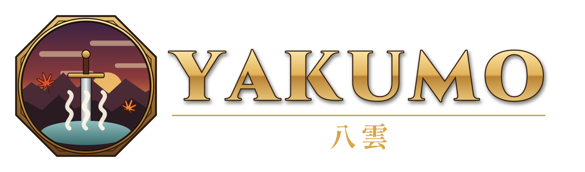

<p align="center"></p>

<p align="center"><b>English</b> · <a href="README.ru.md">Русский</a> · <a href="README.es.md">Español</a></p>

# Yakumo

A native port of **Monster Hunter Portable 3rd HD Ver.** made by static recompilation: the game's PSP code is translated ahead of time into C++ and compiled for your machine, then run on a reimplementation of the PSP system software. It is not an emulator — there is no interpreter or JIT at the heart of it — and it is not a decompilation.

> **This project does not include any game assets.** You must provide the files from your own legally obtained copy of Monster Hunter Portable 3rd HD Ver. (`NPJB-40001`) to install or build Yakumo.

## Legal disclaimer

**Yakumo** is an independent, open-source project and is not affiliated with, authorized by, sponsored by, or endorsed by CAPCOM, Sony, or any of their affiliates.

Monster Hunter, Monster Hunter Portable 3rd HD Ver., CAPCOM, PlayStation, PSP, and all related trademarks, game assets, artwork, audio, characters, and other intellectual property belong to their respective owners.

**Yakumo** does not include any game assets or original game files: no disc image, no copy of the game's executable or data, and no textures, models, audio or video from the game. You must provide the files from your own legally obtained copy of Monster Hunter Portable 3rd HD Ver. to install or build **Yakumo**; the installer checks that copy and accepts only the original release.

To use **Yakumo**, users must provide the required files from their own legally obtained copy of Monster Hunter Portable 3rd HD Ver. for PlayStation 3.

Users are solely responsible for obtaining, dumping, extracting, and using their game copy in accordance with the laws applicable in their jurisdiction.

**Yakumo** does not support, provide, link to, or encourage the use of unauthorized or pirated copies of the game.

Any references to the original game or its trademarks are made solely for identification, compatibility, and interoperability purposes.

Screenshots and other depictions of the original game may be used solely to document or demonstrate **Yakumo's** functionality. All depicted third-party game content remains the property of its respective rights holders.

The license covering **Yakumo** applies only to the project's own original code and materials and does not grant any rights to third-party intellectual property.

**Yakumo** provides the software, not the game. You must provide your own legally obtained copy.

## Status: playable

You can load a save copied from a PSP or start a new game, hunt, play with other hunters and save your progress, with music, movies and lighting. The game simulation stays at the PSP's 30 frames per second; optional frame interpolation presents it at 45, 60, 90, 120 or the display's refresh rate without changing game speed. Loads are shorter than on a PSP: while the game loads in silence, it runs ahead of real time (*Fast loading*, on by default).

| Works | Missing or rough |
| --- | --- |
| Booting, menus, character creation, the village and hunting areas | |
| Saves in the PSP's own format, including saves and downloaded quests copied from a PSP; import, export and backups from the menu | Curved surfaces (#10); the save-data dialogs draw nothing yet (#33) |
| Vulkan graphics: models, animation, textures, transparency, lighting and fog; adjustable internal resolution, arbitrary window shapes and frame interpolation | |
| PPSSPP-compatible HD texture packs, installed from the menu or copied into the data directory | |
| Mods in the community's mhp3reload format: file replacements and patches, managed from the menu (see the [profile README](profiles/mhp3rd/README.md#mods)) | Code mods (#81) |
| Sound effects, streamed music and cutscene movies | |
| Fully rebindable keyboard and mouse controls; gamepads with an analog right-stick camera and aim, plus bow and bowgun trigger profiles | |
| Yakumo's in-game menu, first-run setup, file browser and on-screen keyboard, all usable with a gamepad, keyboard or mouse | |
| All 355 code overlays recompiled | |
| Multiplayer: through the ad hoc servers PSP players use, or hosted from the game on a LAN or VPN | |

Tested on macOS (Apple Silicon, Vulkan through MoltenVK), on a Steam Deck in Game Mode with native Vulkan and the built-in controls, and on Windows 11 with MSVC.

The state of each part of the game on each platform is in [`docs/COMPATIBILITY.md`](docs/COMPATIBILITY.md).

## Play

A prebuilt release needs nothing but your disc image. Download one from the [releases page](https://github.com/TeamGDB/Yakumo/releases), start it, and point the first-run setup at your image: it checks the image, prepares the game from it and keeps everything in a per-user directory.

- **Linux and Steam Deck:** a Flatpak bundle and a portable tarball. [`docs/LINUX.md`](docs/LINUX.md) covers installing, the first start, Game Mode, where saves live, updating and uninstalling.
- **Windows:** a portable x86-64 archive with the required runtime libraries.
- **macOS (Apple Silicon, macOS 13 or newer):** a disk image with the app. It is not notarized by Apple, so macOS asks you to allow it once. [`docs/MACOS.md`](docs/MACOS.md) covers installing, the first start, where saves live, updating and uninstalling.
- **Android:** an APK for 64-bit phones and handhelds with Android 10 or later and Vulkan 1.1. On its first start it takes your `.iso` through Android's file picker and copies it into the app (about 1.3 GB besides the app's 0.8 GB). Touch controls are drawn over the game; gamepads work too. Tested on the emulator only so far ([#127](https://github.com/TeamGDB/Yakumo/issues/127)).

## Requirements

Building from source is a fully supported way to play. It needs:

- Your own copy of the game (see above)
- CMake 3.20 or newer, Ninja and a C++20 compiler
- Python 3
- SDL3, Vulkan and `glslangValidator`
- `make` and a C compiler on macOS and Linux: the build makes its own FFmpeg for the music and the movies. Nothing to install for it on Windows
- A few gigabytes of free memory for the build; the recompiled code is large

## Getting started

In short:

1. Prepare the game's executable from your disc image: build `Yakumo` once without recompiled code and run it with `--install /path/to/image.iso`. No external decryption tool is needed. Then link the image and that executable into the profile with `profiles/mhp3rd/scripts/prepare_game.sh`.
2. Configure, generate the recompiled code with `profiles/mhp3rd/scripts/generate.sh`, and build `Yakumo`.
3. Recompile the code overlays with `profiles/mhp3rd/scripts/build_overlays.sh` (about 40 minutes the first time; resumable).
4. Run `out/mhp3rd/bin/Yakumo`.

The full instructions, including every setting, are in [`profiles/mhp3rd/README.md`](profiles/mhp3rd/README.md). Building on every platform, Windows included, how long each stage takes, and how to work on the code without full rebuilds: [`docs/BUILDING.md`](docs/BUILDING.md).

## Controls

On a gamepad the buttons are where you expect them: on a PlayStation pad circle confirms and cross backs out, as the game's prompts say, and the right stick drives the camera and aiming. Optional trigger profiles put aiming on L2 and a bow or bowgun attack on R2. Keyboard and mouse play is complete and rebindable; by default WASD moves, the mouse controls the camera, and its buttons attack. The full tables are in the [profile README](profiles/mhp3rd/README.md#running).

Esc, or both sticks pressed together (L3+R3), opens Yakumo's own menu. It holds video, audio, control, network and save settings, including aspect ratio, frame rate, internal resolution and HD texture pack import. The first start sets the game up from your disc image in the same window, and works with a gamepad alone.

## Roadmap

- Android on real phones: device testing, graphics drivers and performance ([#127](https://github.com/TeamGDB/Yakumo/issues/127), [#17](https://github.com/TeamGDB/Yakumo/issues/17))
- One consistent visual style across Yakumo's setup screens, menus and overlays ([#33](https://github.com/TeamGDB/Yakumo/issues/33))
- Touch controls for gameplay, menus, camera movement and aiming

## How it works

The executable is analyzed and every instruction of its code is emitted as C++, which is compiled into the program. The game also loads 355 code overlays at run time into a handful of shared memory slots; each is recompiled into its own library, and when the game loads one, the matching library is installed between frames. An interpreter covers any code the recompiled set does not reach, so nothing stops the game — it only runs slower there.

Around that code sits a reimplementation of the PSP system: a kernel with threads, semaphores, event flags and timers; disc I/O read straight from the image; a Vulkan renderer for the PSP's graphics engine; software voice mixing for audio; and input from SDL3.

[`docs/ARCHITECTURE.md`](docs/ARCHITECTURE.md) describes the execution model and [`docs/DATA_BIN.md`](docs/DATA_BIN.md) the game's archive format. [`docs/TESTING.md`](docs/TESTING.md) has the smoke test and how to report results.

## Repository layout

```text
include/psprecomp/   Framework interfaces: runtime, memory, Allegrex state
src/                 Framework: ELF loading, decoder, runtime, interpreter
tools/               Framework: analyzer and C++ code generator
tests/               Framework regression tests
configs/             PSP NID data and generic examples
profiles/mhp3rd/     Everything specific to this game: host, kernel, renderer,
                     audio, input, configuration and build scripts
docs/                Architecture, archive format, profile guide, source rules
```

The recompiled code itself is generated locally from your copy of the game and is never committed.

## Built on PSPRecomp

**Yakumo** is built on [PSPRecomp](https://github.com/jessicanataliagta/PSPRecomp), a static recompilation framework for PSP software. The framework is game-neutral and can be built on its own:

```bash
cmake -S . -B out/framework -DPSPRECOMP_PROFILE=""
cmake --build out/framework --config Release
ctest --test-dir out/framework -C Release --output-on-failure
```

To target another title, see [`docs/PROFILE_GUIDE.md`](docs/PROFILE_GUIDE.md). [`docs/SOURCE_PROVENANCE.md`](docs/SOURCE_PROVENANCE.md) sets out the rules for independently written code and third-party source.

## Authors

- [@MHunterG](https://github.com/MHunterG)
- [@mojitosunrise](https://github.com/mojitosunrise)

## Credits

- [PSPRecomp](https://github.com/jessicanataliagta/PSPRecomp) — the recompilation framework this project builds on
- [SDL3](https://www.libsdl.org/) — windowing, input and audio output
- [FFmpeg](https://ffmpeg.org/) — music and movie decoding
- [Vulkan](https://www.vulkan.org/) and [MoltenVK](https://github.com/KhronosGroup/MoltenVK) — rendering
- [Dear ImGui](https://github.com/ocornut/imgui) — Yakumo's menus and setup screens
- [tiny-AES-c](https://github.com/kokke/tiny-AES-c) — the installer and PSP save-data support
- [stb_truetype](https://github.com/nothings/stb) — font rasterization
- [svanheulen/mhef](https://github.com/svanheulen/mhef) — community documentation of the game's archive format
- [Cinzel](https://github.com/NDISCOVER/Cinzel) and [Shippori Mincho](https://github.com/fontdasu/ShipporiMincho) — the logo's lettering, under the SIL Open Font License

## License

The repository is distributed under the MIT License; see [`LICENSE`](LICENSE). Third-party files keep their own notices beside them; [`docs/SOURCE_PROVENANCE.md`](docs/SOURCE_PROVENANCE.md) lists their origins and licences.
